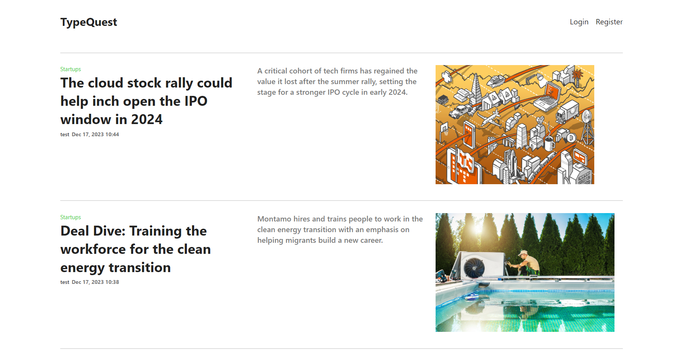
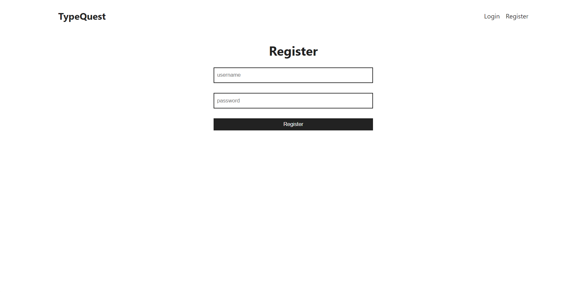
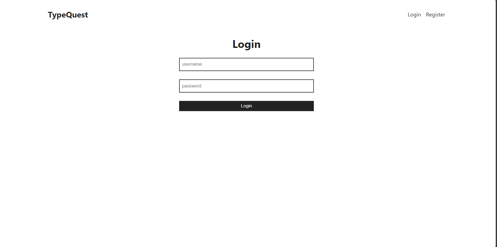
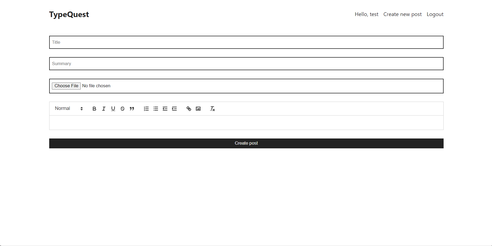

# TypeQuest

A simple blog application built using the MERN stack. Contains both client and server side application code.

## Screenshots
Home Screen


Register Screen


Login Screen


post Screen

## Server Deployment

To run the server side code first,

```bash
  cd api
```

Install all packages and dependencies

```bash
  npm i
```

Run the server

```bash
  npm run dev
```

## Client Deployment

To run the client side code first,

```bash
  cd client
```

Install all packages and dependencies

```bash
  npm i
```

Run the client

```bash
  npm run dev
```